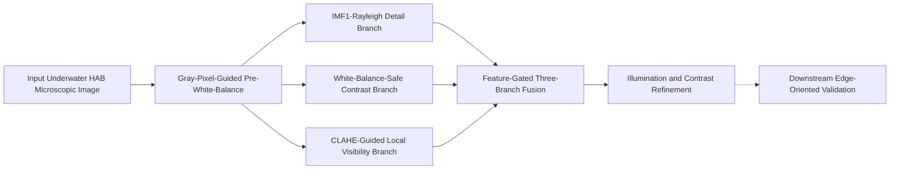

# 方法总览图说明

最后更新：2026-04-17

本文档用于定义当前 HAB 水下显微图像增强方法的总览图，确保图的布局、节点命名、图注措辞和方法部分引用方式都与真实实现一致。

## 图示目标

方法总览图应让读者一眼看出四件事：

1. 本文方法是分阶段框架，而不是单一整体增强算子；
2. 中间三条分支具有明确不同的职责；
3. 融合是特征门控、面向亮度结构的融合，而不是简单 RGB 平均；
4. 下游边缘友好验证属于任务化评估，不属于核心增强算子本体。

## 推荐图题

- 中文：
  `方法总览图`
- 英文：
  `Overview of the Proposed Stage-Wise Enhancement Framework`

## 主线叙事

图中应展示一个六阶段增强算子，以及一个外部评估目标：

`Input -> BPH -> {IMF1Ray, RGHS, CLAHE} -> Fused -> Final`

然后从 `Final` 向独立评估模块添加一条虚线箭头：

`Final -> Downstream edge-oriented validation`

重要写作边界：

- 增强算子本体到 `Final` 为止。
- 下游验证模块应画成外部任务化评估分支，而不是增强流水线主体的一部分。

## 节点命名

### 论文图中推荐标签

| 内部 / 历史名称 | 推荐图中标签 | 作用 |
| --- | --- | --- |
| `Original` | Input Underwater HAB Microscopic Image | 原始输入 |
| `BPH` | Gray-Pixel-Guided Pre-White-Balance | 上游稳定化 |
| `IMF1Ray` | IMF1-Rayleigh Detail Branch | 高频细节与边缘恢复 |
| `RGHS` | White-Balance-Safe Contrast Branch | 主体对比与亮度锚定 |
| `CLAHE` | CLAHE-Guided Local Visibility Branch | 背景与低可见性补偿 |
| `Fused` | Feature-Gated Three-Branch Fusion | 亮度结构融合 |
| `Final` | Illumination and Contrast Refinement | 轻量输出收口 |

### 框内可选短标签

- `Pre-WB`
- `Detail`
- `Contrast`
- `Visibility`
- `Fusion`
- `Refine`

如果图中空间有限，可在框内使用短标签，并把完整名称放入图注或旁注。

## 推荐布局

### 版本 A：论文主图

使用一条水平主链路和一次纵向分支展开：

1. 最左侧放输入图像模块；
2. 后接一个 `Pre-White-Balance` 模块；
3. 中间并行放三条分支：
   - `IMF1-Rayleigh Detail`
   - `WB-Safe Contrast`
   - `CLAHE-Guided Visibility`
4. 分支汇合后放一个 `Feature-Gated Fusion` 模块；
5. 最右侧放一个 `Refinement` 模块；
6. 在右侧上方或下方放一个虚线外部模块，用于下游验证。

### 版本 B：汇报或海报版本

使用宽横向链路：

`Input -> Pre-WB -> Detail / Contrast / Visibility -> Fusion -> Refinement -> Output`

在三条分支模块下方放三个短说明：

- `Edge / texture`
- `Subject / anchor`
- `Background / low-visibility`

## 框内内容建议

### 输入图像模块

展示一张具有代表性的原始 HAB 水下显微图像。

文字建议：

`Input image`

### 前置白平衡模块

展示一个稍微校正后的中间图像，或使用符号化模块表示。

文字建议：

`Gray-pixel guidance`
`Clipped ACCC compensation`
`Brightness restoration`

### IMF1-Rayleigh 高频细节分支

文字建议：

`2D-EMD IMF1 extraction`
`Edge-aware detail injection`
`Rayleigh luminance matching`

### 白平衡安全对比分支

文字建议：

`Lab luminance enhancement`
`Flat-region suppression`
`Adaptive chroma protection`

### CLAHE 引导的局部可见性分支

文字建议：

`CLAHE-derived gain map`
`Guided gain smoothing`
`WB-preserving brightness scaling`

### 融合模块

文字建议：

`Gradient / texture / saliency / exposure weights`
`Region-dependent gating`
`Laplacian-pyramid fusion`
`RGHS chroma anchoring`

### 收口模块

文字建议：

`Homomorphic illumination correction`
`Entropy-oriented Lab adjustment`

### 下游验证模块

文字建议：

`Edge-sensitive downstream validation`
`Not part of the enhancement operator`

## 图中应强调的内容

图中应重点强调：

- `Pre-White-Balance` 是三条分支共享的上游入口；
- 中间三条分支是互补关系，而不是彼此竞争的重复增强；
- `Fusion` 是方法的概念中心；
- `Refinement` 是轻量收口阶段。

图中不应暗示：

- `RGHS` 是现成标准 RGHS 模块；
- `CLAHE` 分支直接输出原始 CLAHE 结果；
- 最终收口阶段是主要创新点；
- 下游验证被反向融合进增强算子本体。

## 建议配色逻辑

如果使用颜色，应保持语义稳定：

- `Pre-White-Balance`：中性蓝灰色
- `Detail branch`：冷色强调
- `Contrast branch`：暖色强调
- `Visibility branch`：绿色强调
- `Fusion`：深色中性强调
- `Refinement`：浅色中性收口
- `Downstream evaluation`：灰色虚线

不要让所有分支复用同一种色相。配色目的在于让分支职责清晰，而不是做装饰。

## Mermaid 草图

该 Mermaid 代码只作为结构草图。正式论文图应使用输入图、中间结果缩略图或更精致的模块绘制。

## 图注草稿

### 中文图注

`图 X. 本文提出的分阶段增强框架总览。输入图像首先经过灰像素引导的前置白平衡模块，以稳定颜色起点；随后，从白平衡结果并行生成 IMF1-Rayleigh 高频细节分支、白平衡安全对比分支和 CLAHE 引导的局部可见性分支；三条分支在亮度空间中通过特征门控的拉普拉斯金字塔融合进行协同整合，并经过轻量照明与对比收口得到最终输出。下游边缘友好验证作为任务化评估路径单独呈现，不属于增强算子本体。`

### 英文图注（仅供英文稿辅助）

`Fig. X. Overview of the proposed stage-wise enhancement framework. The input image is first stabilized by a gray-pixel-guided pre-white-balance module. Three complementary branches are then constructed for IMF1-Rayleigh detail recovery, white-balance-safe contrast enhancement, and CLAHE-guided local visibility compensation. Their outputs are integrated by feature-gated Laplacian-pyramid fusion in the luminance domain, followed by lightweight illumination and contrast refinement. Downstream edge-oriented validation is presented as a task-facing evaluation path rather than part of the enhancement operator itself.`

## 正文引用图示的句子

### 中文

`如图 X 所示，本文方法并不是将单一增强算子直接施加于整幅图像，而是先通过前置白平衡稳定输入，再构建三条职责互补的中间分支，并在亮度空间中通过特征门控融合实现结构化协同，最后以轻量收口模块整理输出结果。`

### 英文（仅供英文稿辅助）

`As illustrated in Fig. X, the proposed method does not rely on a single global enhancement operator. Instead, it first stabilizes the input by pre-white-balance, then constructs three complementary intermediate branches, and finally integrates them by feature-gated fusion in the luminance domain followed by lightweight refinement.`

## 绘图检查清单

- 展示一张输入图和一张最终输出图。
- 保持三条分支模块在视觉上并行。
- 让 `Fusion` 在视觉上处于中心位置。
- 下游评估模块使用虚线样式。
- 正式图中不要把 `RGHS` 和 `CLAHE` 写成没有解释的孤立缩写。
- 如果展示中间结果缩略图，建议使用：
  - 一个 BPH 示例；
  - 每条中间分支各一个输出；
  - 一个融合输出；
  - 一个最终输出。

## 建议下一步

将本文档进一步落成以下任一版本：

1. 论文用的干净矢量总览图；
2. 适合汇报的简化标签版本；
3. 可直接嵌入论文草稿的“图 + 图注”组合。
