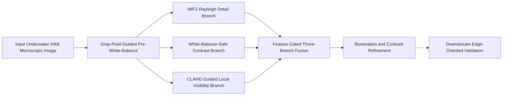

# Method Figure Specification

Last updated: 2026-04-17

This note defines the overview figure for the current underwater HAB microscopic image enhancement method. It is intended to keep the figure layout, node naming, caption wording, and method-section references aligned with the actual implementation.

## Figure Goal

The overview figure should communicate four things at a glance:

1. the method is stage-wise rather than a single monolithic enhancer;
2. the three middle branches have clearly different responsibilities;
3. fusion is feature-gated and luminance-oriented rather than naive RGB averaging;
4. downstream edge-oriented validation belongs to task-facing evaluation, not to the core enhancement operator.

## Recommended Figure Title

- Chinese:
  `方法总览图`
- English:
  `Overview of the Proposed Stage-Wise Enhancement Framework`

## Main Narrative

The figure should show a six-stage enhancement operator plus an external evaluation target:

`Input -> BPH -> {IMF1Ray, RGHS, CLAHE} -> Fused -> Final`

Then add a dashed arrow from `Final` to a separate evaluation block:

`Final -> Downstream edge-oriented validation`

Important writing boundary:

- The enhancement operator itself ends at `Final`.
- The downstream validation block should be drawn as an external task-facing evaluation branch, not as part of the enhancement pipeline body.

## Node Naming

### Paper-facing labels

| Internal / historical name | Recommended figure label | Role |
| --- | --- | --- |
| `Original` | Input Underwater HAB Microscopic Image | raw input |
| `BPH` | Gray-Pixel-Guided Pre-White-Balance | upstream stabilization |
| `IMF1Ray` | IMF1-Rayleigh Detail Branch | high-frequency detail and edge recovery |
| `RGHS` | White-Balance-Safe Contrast Branch | subject contrast and luminance anchoring |
| `CLAHE` | CLAHE-Guided Local Visibility Branch | background and low-visibility compensation |
| `Fused` | Feature-Gated Three-Branch Fusion | luminance-structure fusion |
| `Final` | Illumination and Contrast Refinement | lightweight output closing |

### Optional short labels inside boxes

- `Pre-WB`
- `Detail`
- `Contrast`
- `Visibility`
- `Fusion`
- `Refine`

If the figure is space-limited, use the short labels in the boxes and put the full names in the caption or callouts.

## Recommended Layout

### Version A: paper main figure

Use one horizontal main chain and one vertical branch fan-out:

1. leftmost input image block;
2. one `Pre-White-Balance` block;
3. three parallel branch blocks in the middle row:
   - `IMF1-Rayleigh Detail`
   - `WB-Safe Contrast`
   - `CLAHE-Guided Visibility`
4. one `Feature-Gated Fusion` block after the branch merge;
5. one `Refinement` block at the right end;
6. one dashed external block below or above the right side for downstream validation.

### Version B: slide / poster version

Use a wide horizontal chain:

`Input -> Pre-WB -> Detail / Contrast / Visibility -> Fusion -> Refinement -> Output`

Put three short callouts under the three branch blocks:

- `Edge / texture`
- `Subject / anchor`
- `Background / low-visibility`

## Box-Level Content

### Input

Show one representative raw underwater HAB microscopic image.

Text suggestion:

`Input image`

### Pre-White-Balance

Show a slightly cleaner intermediate image or a symbolic block.

Text suggestion:

`Gray-pixel guidance`
`Clipped ACCC compensation`
`Brightness restoration`

### IMF1-Rayleigh Detail Branch

Text suggestion:

`2D-EMD IMF1 extraction`
`Edge-aware detail injection`
`Rayleigh luminance matching`

### White-Balance-Safe Contrast Branch

Text suggestion:

`Lab luminance enhancement`
`Flat-region suppression`
`Adaptive chroma protection`

### CLAHE-Guided Local Visibility Branch

Text suggestion:

`CLAHE-derived gain map`
`Guided gain smoothing`
`WB-preserving brightness scaling`

### Fusion

Text suggestion:

`Gradient / texture / saliency / exposure weights`
`Region-dependent gating`
`Laplacian-pyramid fusion`
`RGHS chroma anchoring`

### Refinement

Text suggestion:

`Homomorphic illumination correction`
`Entropy-oriented Lab adjustment`

### Downstream Validation Block

Text suggestion:

`Edge-sensitive downstream validation`
`Not part of the enhancement operator`

## What Should Be Visually Emphasized

The figure should visually emphasize:

- `Pre-White-Balance` as the shared upstream entrance;
- the three middle branches as complementary rather than competing replicas;
- `Fusion` as the conceptual center of the method;
- `Refinement` as a lightweight closing stage.

The figure should not visually imply:

- that `RGHS` is a standard off-the-shelf RGHS module;
- that `CLAHE` outputs raw CLAHE directly;
- that the final refinement stage is the main innovation;
- that downstream validation is fused back into the enhancement operator.

## Suggested Color Logic

If colors are used, keep the semantics stable:

- `Pre-White-Balance`: neutral blue-gray
- `Detail branch`: cool accent
- `Contrast branch`: warm accent
- `Visibility branch`: green accent
- `Fusion`: dark neutral emphasis
- `Refinement`: light neutral closing
- `Downstream evaluation`: dashed gray

Do not reuse the same hue for all branches. The point is to make branch responsibility legible, not decorative.

## Mermaid Draft

This Mermaid block is only a structural sketch. The actual paper figure should be drawn with images, intermediate thumbnails, or polished blocks.

## Caption Draft

### Chinese caption

`图 X. 本文提出的分阶段增强框架总览。输入图像首先经过灰像素引导的前置白平衡模块，以稳定颜色起点；随后，从白平衡结果并行生成 IMF1-Rayleigh 高频细节分支、白平衡安全对比分支和 CLAHE 引导的局部可见性分支；三条分支在亮度空间中通过特征门控的拉普拉斯金字塔融合进行协同整合，并经过轻量照明与对比收口得到最终输出。下游边缘友好验证作为任务化评估路径单独呈现，不属于增强算子本体。`

### English caption

`Fig. X. Overview of the proposed stage-wise enhancement framework. The input image is first stabilized by a gray-pixel-guided pre-white-balance module. Three complementary branches are then constructed for IMF1-Rayleigh detail recovery, white-balance-safe contrast enhancement, and CLAHE-guided local visibility compensation. Their outputs are integrated by feature-gated Laplacian-pyramid fusion in the luminance domain, followed by lightweight illumination and contrast refinement. Downstream edge-oriented validation is presented as a task-facing evaluation path rather than part of the enhancement operator itself.`

## Paragraph for Referring to the Figure

### Chinese

`如图 X 所示，本文方法并不是将单一增强算子直接施加于整幅图像，而是先通过前置白平衡稳定输入，再构建三条职责互补的中间分支，并在亮度空间中通过特征门控融合实现结构化协同，最后以轻量收口模块整理输出结果。`

### English

`As illustrated in Fig. X, the proposed method does not rely on a single global enhancement operator. Instead, it first stabilizes the input by pre-white-balance, then constructs three complementary intermediate branches, and finally integrates them by feature-gated fusion in the luminance domain followed by lightweight refinement.`

## Figure Drawing Checklist

- Show one input image and one final output image.
- Keep the three branch blocks visually parallel.
- Make `Fusion` visually central.
- Use a dashed style for the downstream evaluation block.
- Avoid writing `RGHS` and `CLAHE` as unexplained standalone acronyms in the final figure.
- If intermediate thumbnails are shown, use:
  - one BPH example,
  - one branch output for each middle branch,
  - one fused output,
  - one final output.

## Recommended Next Step

Turn this note into one of the following:

1. a clean vector overview figure for the paper;
2. a slide-friendly version with simplified labels;
3. a figure-plus-caption pair embedded directly into the paper draft.
